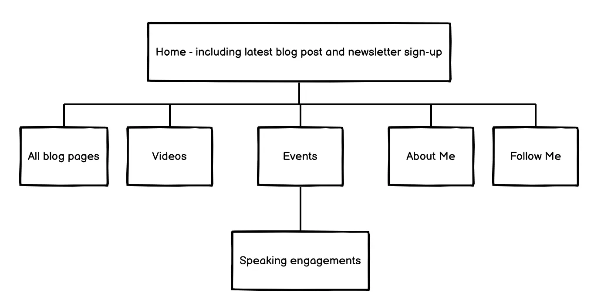
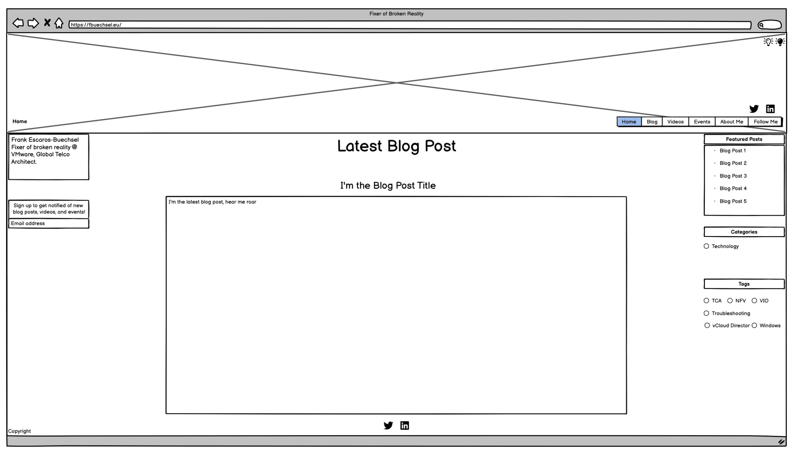
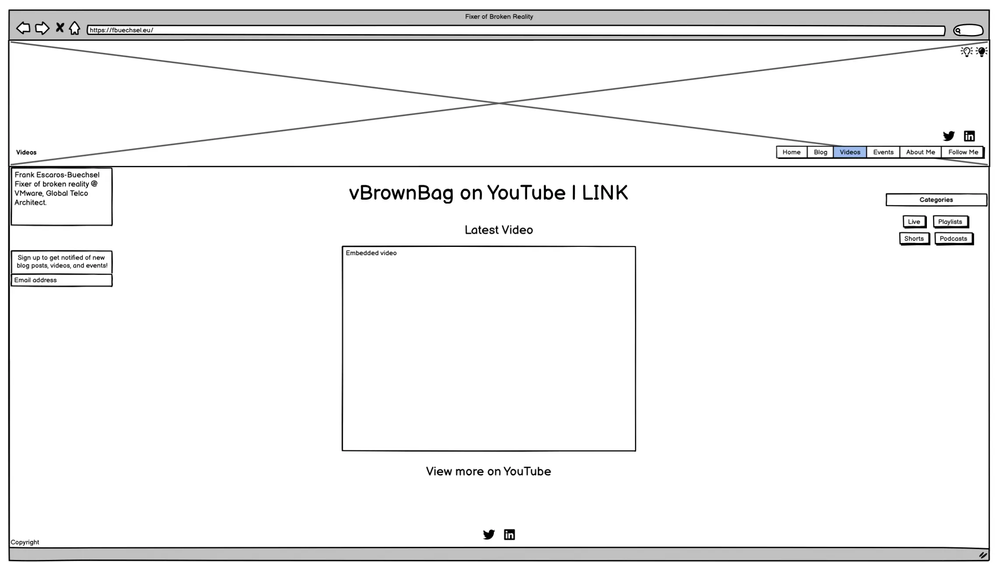
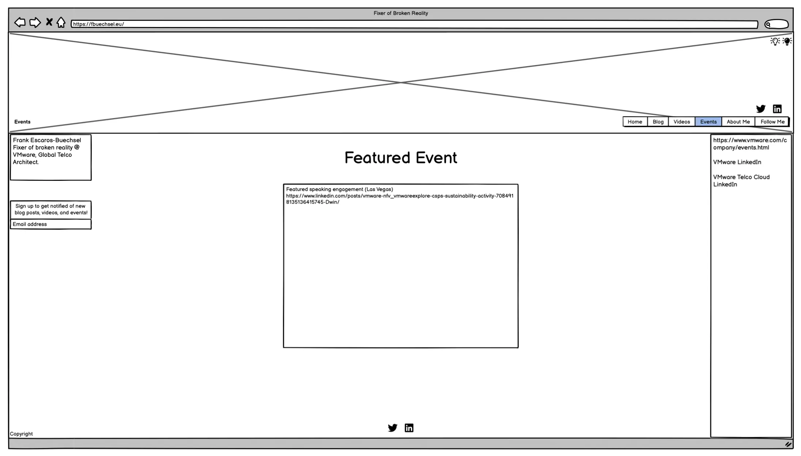
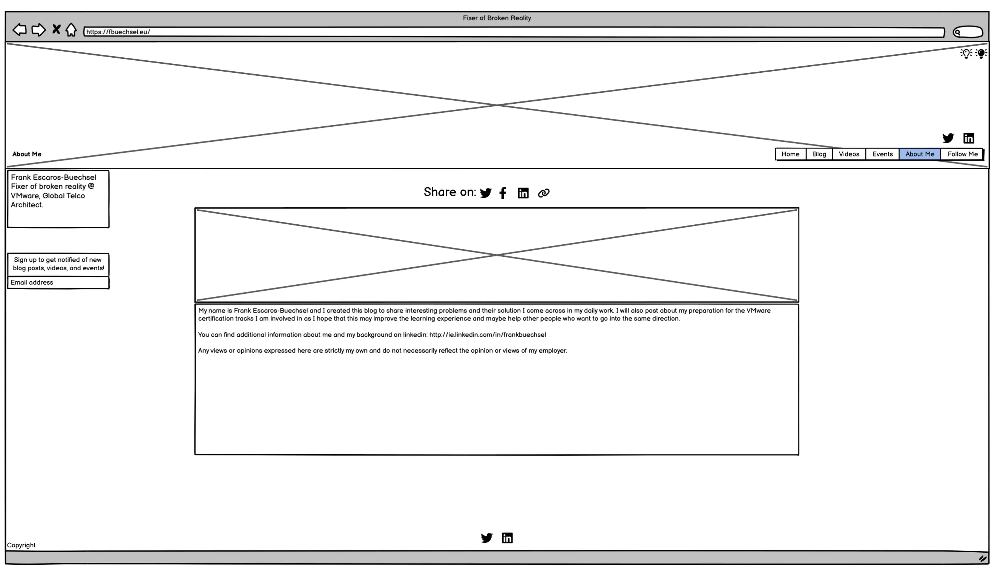

# fbuechsel's Blog

This site is to help people learn more about VMware topics, particularly relating to certification tracks. Reading the various blog posts on the site should improve the learning experience for others who also want to work towards VMware certifications. There is other VMware-related techincal information available for users interested in watching videos or joining in events as well.

1. [User Stories](#user-stories)
2. [Features](#features)
3. [Deployment](#deployment)
4. [Credits](#credits)
5. [Media](#media)

## User Stories

- As a user, I want to view the various blog posts so that I can learn more about topics included in VMware certifications.

- As a user, I want to know what VMware events are available so that I can register for or follow those.

- As a user, I want to be able to view videos on the topic, so that I can learn more.

## Features 

- __Navigation Bar__ is available on all pages of the site to let the user easily switch between pages.

- __Side Bar__ includes relevant, customised details for each page. The brief introduction of the site owner and a newsletter sign-up is on the left side. The right side includes on all, except the About Me page, links relevant to the content of the page the user is on. For example, external video links on the Videos page, or pages that posts different events on the Events page.

- __Homepage__ shows the latest blog post on the site with links to share the post. *- coming soon* - It also has some links in the right side bar to access featured posts, and posts relating to specific categories and with specific tags.

- __Blog Page__ includes all blog posts for the user to read with buttons to share the post on social media sites.

- __Featured Posts__ in the left sidebar of both the homepage and blog page include selected posts from the blog owner that the user can load via a click of the mouse.

- __Blog Tags__ can be used to show all posts with a specific tag, in case the user is looking for content related to a specific topic.

- __Videos Page__ has the latest YouTube video embedded from the vBrownBag YouTube channel. The right side bar also has additional links to the official vBrownBag website, as well as to different categories of videos on their YouTube channel.

- __Events Page__ features the main event - typically a speaking engagement of the blog owner - with additional links in the right side bar. The user can locate additional official pages that post relevant events, whenever they are announced.

- __About Me Page__ has information on the blog owner so the user can learn more about them.

- __Follow Me Button__ will redirect the user to the blog owner's Twitter page.

- __Landing Page Image__ should show users that the site is about data and cloud computing.

- __Footer__ shows copyright information for the website.

- __Dynamic page sizing__ is available for users on different sized devices to ensure a smooth user experience navigating the page content.

### Features Left to Implement

- __Newsletter Signup__ option for users who want to be updated on blog posts and events. However, while the signup looks to work from a user perspective, at the moment, no data is written to any database, and no actual newsletter is set up.

## Testing 
1. Started with checking the site using Wave and resolving minor issues
2. Used the Jigsaw W3 Validator next, and no errors were found
3. Continued with the HTML Checker and resolved issues identified
	3a. Buttons in anchor tags -> Removed buttons and styled with CSS classes instead
	3b. Removed obsolete center tags
	3c. YouTube and LinkedIn embedded links use obsolete frameborder attribures -> Removed
	3d. Duplicate IDs updated
	3e. Removed duplicate a tags
4. Checked the website using Lighthouse
5. Resolved Accessibility issues identified by Lighthouse
	5a. aria-label set for i tag -> wrapped i in span tags and added the aria-label there instead
	5b. Updated IDs that were duplicate with classes
6. Resolved SEO issues identified by Lighthouse
	6a. Set font size and added spacing between list items for the right panel on the blog page
7. Resolved Performance issues identifiedb y Lighthouse
	7a. Set CSS height/weight for blog images
	7b. Converted all images to webp format
	7c. Set explicit image sizes for all img tags

### Validator Testing 

#### HTML Checker
All pages were checked using the HTML Checker. Some issues were identified as described in Testing. All were resolved until no further errors were identified for any of the pages, as evidenced [here](https://validator.w3.org/nu/?doc=https%3A%2F%2Fcrazycooky77.github.io%2Fci_projects%2Findex.html) and in the image below.

#### W3C
All pages were checked using [the Jigsaw W3 Validator](https://jigsaw.w3.org/css-validator/#validate_by_uri) and no errors were found as evidenced on [this page](https://jigsaw.w3.org/css-validator/validator?uri=https%3A%2F%2Fcrazycooky77.github.io%2Fci_projects%2Findex.html&profile=css3svg&usermedium=all&warning=1&vextwarning=&lang=en) and via the image below.

#### Lighthouse
The website was checked using Lighthouse and issues that were identified resolved as best possible. Therefore, the latest scores for the site is as below.
##### Index

Multiple steps were taken to improve Performance, as outlined in [Testing](#testing) (step 7), however 88 was the highest score achieved.

##### Blog

##### Videos

##### Events

##### About Me

#### Wave
- Wave provides a contrast error for the H1 header of the website. Due to the CSS border added, the text is legible, despite the font colour being essentially transparent. This was a stylistic choice to leave as-is.

## Deployment

The site was deployed to GitHub Pages via the following steps:
1. Cloned [repository from Code Institute](https://github.com/Code-Institute-Org/ci-full-template) and created own [repository](https://github.com/crazycooky77/ci_projects) for all Code Institute projects
2. Created [new branch](https://github.com/crazycooky77/ci_projects/tree/fbuechsel) for this specific site
3. Used GitHub Desktop for file updates and commits
4. Opened Settings for the repository
5. Clicked Pages from the left sidebar
6. Chose to "Deploy from a branch" for the Source
7. Selected the fbuechsel branch for this project and clicked "Save"

### Issues

Unfortunately the site deployment didn't work after the initial steps. After waiting an extended period of time, no GitHub Pages site was created from the repository. After some research, I located [this discussion](https://github.com/orgs/community/discussions/22506) and was able to resolve the issue with the steps therein and in [this GitHub documentation](https://docs.github.com/en/pages/setting-up-a-github-pages-site-with-jekyll/adding-a-theme-to-your-github-pages-site-using-jekyll):

1. Created new \_config.yml file in the root folder of the fbuechsel branch in the repository
2. Copy/pasted "theme: minima" into the file and saved it
3. Committed the changes directly to the fbuechsel branch
4. The deployment then finalised on it's own and the GitHub Pages site was available

## Credits 

### Content 

- The base template was cloned from the [Code Institute GitHub repository](https://github.com/Code-Institute-Org/ci-full-template)
- The basic readme and HTML templates were copied from [CluelessBiker's mentoring repository](https://github.com/CluelessBiker/mentoring/tree/main)
- The majority of text content (blog posts) was taken from https://fbuechsel.eu/
	- No HTML/CSS content was taken from this page
- Font used from [Google Fonts](https://fonts.google.com/specimen/Share+Tech)
- Social media, calendar, and copy icons were taken from [Font Awesome](https://fontawesome.com/)
- Script for including HTML files within other files taken from https://www.tutorialspoint.com/how-to-include-another-html-file-in-an-html-file
- Scalable image sizing modified from https://support.glitch.com/t/how-can-i-incorporate-css-to-expand-my-image-on-click-html-css-javascript/30610
- Script for copying to clipboard modified from https://developer.mozilla.org/en-US/docs/Mozilla/Add-ons/WebExtensions/Interact_with_the_clipboard
- Script to listen for Escape key press taken from https://www.geeksforgeeks.org/how-to-detect-escape-key-press-using-jquery/
- Action to remove focus from active element taken from https://bobbyhadz.com/blog/javascript-remove-focus-from-element
- Dummyframe for newsletter submission taken from https://stackoverflow.com/questions/25983603/how-to-submit-an-html-form-without-redirection
- Toggling blog post visibility on blog.html written using the script examples in 3 Stackoverflow posts: [one](https://stackoverflow.com/questions/37985388/toggle-visibility-of-all-divs-at-once), [two](https://stackoverflow.com/questions/19065133/using-a-javascript-variable-to-refer-to-an-element-with-id-containing-the-variab), [three](https://stackoverflow.com/questions/55603456/a-simple-way-to-show-one-div-and-hide-all-others)
- Modified text-shadow solution for H1 header from https://stackoverflow.com/questions/2570972/css-font-border
- Used https://www.youtube.com/watch?v=LciQi9PMnFY&ab_channel=CampsiteCoders for guidance on hamburger menus for smaller screen sizes

## Media

### Wireframes

I created basic wireframes to plan out the layout for the website. The final version of the acutal website differs slightly, as some other styling options looked better than those initially planned. Some differences include the left-side page title, which was deemed unnecessary with button highlighting and actual headers replacing it. Also, a Follow Me button was planned in the navigation, but also some social links in the footer. As both are not needed, those in the footer were discarded.

#### Planning

#### Homepage

#### Blog

#### Videos

#### Events

#### About
