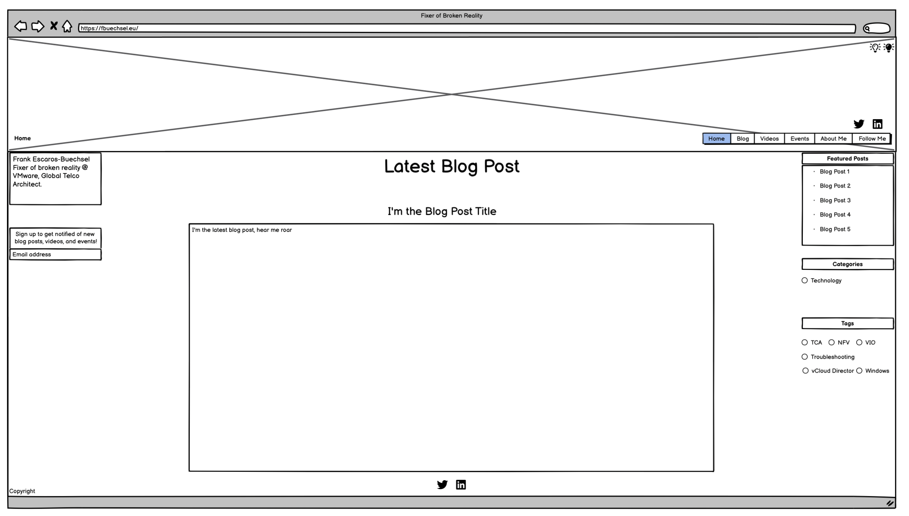
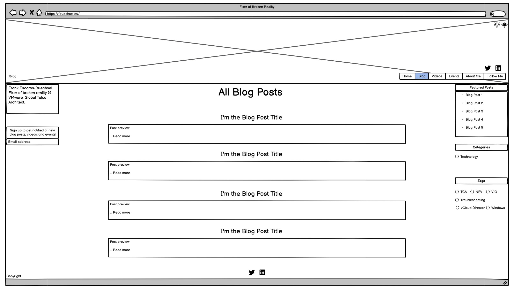
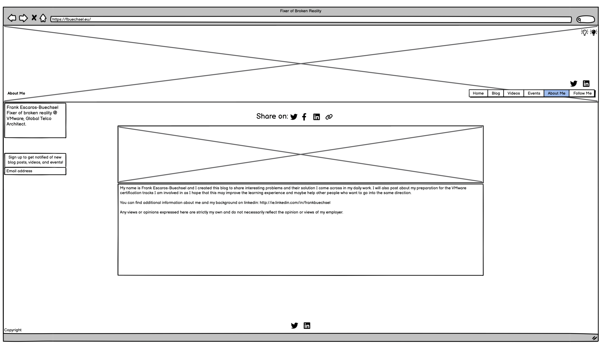

# fbuechsel's Blog

This site is to help people learn more about VMware topics, particularly relating to certification tracks. Reading the various blog posts on the site should improve the learning experience for others who also want to work towards VMware certifications. There is other VMware-related techincal information available for users interested in watching videos or joining in events as well.

## User Stories

- As a user, I want to view the various blog posts so that I can learn more about topics included in VMware certifications.

- As a user, I want to know what VMware events are available so that I can register for or follow those.

## Features 

- __Navigation Bar__ is available on all pages of the site to let the user easily switch between pages.

- __Side Bar__ includes relevant, customised details for each page. The brief introduction of the site owner and a newsletter sign-up is on the left side. The right side includes on all, except the About Me page, links relevant to the content of the page the user is on. For example, external video links on the Videos page, or pages that posts different events on the Events page.

- __Homepage__ shows the latest blog post on the site with links to share the post. *- coming soon* - It also has some links in the right side bar to access featured posts, and posts relating to specific categories and with specific tags.

- __Videos Page__ has the latest YouTube video embedded from the vBrownBag YouTube channel. The right side bar also has additional links to the official vBrownBag website, as well as to different categories of videos on their YouTube channel.

- __Events Page__ features the main event - typically a speaking engagement of the blog owner - with additional links in the right side bar. The user can locate additional official pages that post relevant events, whenever they are announced.

- __About Me Page__ has information on the blog owner so the user can learn more about them.

- __Follow Me Button__ will redirect the user to the blog owner's Twitter page.

- __Landing Page Image__ should show users that the site is about data and cloud computing.

- __Footer__ shows copyright information for the website.

### Features Left to Implement

- __Newsletter Signup__ option for users who want to be updated on blog posts and events. However, while the signup looks to work from a user perspective, at the moment, no data is written to any database, and no actual newsletter is set up.

- __Blog Page__

- __Featured Posts__ 

- __Blog Categories__ 

- __Blog Tags__ 

<!-- ## Testing  -->

<!-- ### Validator Testing  -->

<!-- ## Deployment -->

## Credits 

### Content 

- The base template was cloned from the [Code Institute GitHub repository](https://github.com/Code-Institute-Org/ci-full-template)
- The basic readme and HTML templates were copied from [CluelessBiker's mentoring repository](https://github.com/CluelessBiker/mentoring/tree/main)
- The majority of text content (blog posts) was taken from https://fbuechsel.eu/
- Font used from [Google Fonts](https://fonts.google.com/specimen/Share+Tech)
- Social media, calendar, and copy icons were taken from [Font Awesome](https://fontawesome.com/)
- Script for including HTML files within other files taken from https://www.tutorialspoint.com/how-to-include-another-html-file-in-an-html-file
- Scalable image sizing modified from https://support.glitch.com/t/how-can-i-incorporate-css-to-expand-my-image-on-click-html-css-javascript/30610
- Script for copying to clipboard modified from https://developer.mozilla.org/en-US/docs/Mozilla/Add-ons/WebExtensions/Interact_with_the_clipboard
- Script to listen for Escape key press taken from https://www.geeksforgeeks.org/how-to-detect-escape-key-press-using-jquery/
- Action to remove focus from active element taken from https://bobbyhadz.com/blog/javascript-remove-focus-from-element
- Dummyframe for newsletter submission taken from https://stackoverflow.com/questions/25983603/how-to-submit-an-html-form-without-redirection

## Media

### Wireframes

I created basic wireframes to plan out the layout for the website. The final version of the acutal website differs slightly, as some other styling options looked better than those initially planned. Some differences include the left-side page title, which was deemed unnecessary with button highlighting and actual headers replacing it. Also, a Follow Me button was planned in the navigation, but also some social links in the footer. As both are not needed, those in the footer were discarded.

#### Planning

#### Homepage

#### Blog

#### Videos

#### Events

#### About
