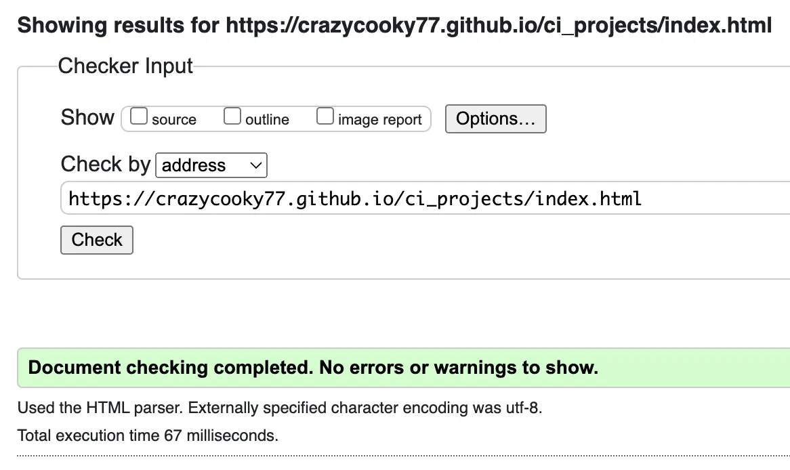

# fbuechsel's Blog

This site is to help people learn more about VMware topics, particularly relating to certification tracks. Reading the various blog posts on the site should improve the learning experience for others who also want to work towards VMware certifications. There is other VMware-related techincal information available for users interested in watching videos or joining in events as well.

1. [User Stories](#user-stories)
2. [Features](#features)
3. [Testing](#testing)
4. [Deployment](#deployment)
5. [Credits](#credits)
6. [Media](#media)

## Known Bugs
When enlarging a blog image using Safari on an iOS device, the focus would get stuck. The user could not reset the image size by tapping elsewhere on the screen, though this works in Chrome on all devices, and in Safari on macOS. For this reason, the image transform option has been disabled entirely for iOS devices until an appropriate fix can be identified.

No other bugs were identified that could not be resolved.

## User Stories

- As a user, I want to view the various blog posts so that I can learn more about topics included in VMware certifications.

- As a user, I want to know what VMware events are available so that I can register for or follow those.

- As a user, I want to be able to view videos on the topic, so that I can learn more.

## Features 

- __Landing Page Image__ should show users that the site is about data and cloud computing.\
[View image (CTRL/CMD+Click for a new tab) by clicking here](https://raw.githubusercontent.com/crazycooky77/ci_projects/fbuechsel/assets/images/site_layout/live-hero.webp)

- __Navigation Bar__ is available on all pages of the site to let the user easily switch between pages.\
[View image (CTRL/CMD+Click for a new tab) by clicking here](https://raw.githubusercontent.com/crazycooky77/ci_projects/fbuechsel/assets/images/site_layout/live-nav.webp)

- __Follow Me Button__ will redirect the user to the blog owner's Twitter page. See image above for the Navigation Bar for details.\

- __Homepage__ shows the latest blog post on the site with links to share the post.\
[View image (CTRL/CMD+Click for a new tab) by clicking here](https://raw.githubusercontent.com/crazycooky77/ci_projects/fbuechsel/assets/images/site_layout/live-home.webp)

- __Side Bar__ includes relevant, customised details for each page. The brief introduction of the site owner and a newsletter sign-up is on the left side. The right side includes on all, except the About Me page, links relevant to the content of the page the user is on. For example, external video links on the Videos page, or pages that posts different events on the Events page. Below is the sidebar from the Blog page.\
[View image (CTRL/CMD+Click for a new tab) by clicking here](https://raw.githubusercontent.com/crazycooky77/ci_projects/fbuechsel/assets/images/site_layout/live-blog-sidebar.webp)

- __Blog Page__ includes all blog posts for the user to read with buttons to share the post on social media sites.\
[View image (CTRL/CMD+Click for a new tab) by clicking here](https://raw.githubusercontent.com/crazycooky77/ci_projects/fbuechsel/assets/images/site_layout/live-blog.webp)

- __Share Options__ are available for each blog post to share the post to social media sites, or copy the link to the post for manual sharing.\
[View image (CTRL/CMD+Click for a new tab) by clicking here](https://raw.githubusercontent.com/crazycooky77/ci_projects/fbuechsel/assets/images/site_layout/live-share.webp)

- __Enlarge Blog Images__ on any of the blog posts to see the images in a bigger format for better viewing. This can be done via mouseclick, and clicking outside of the image area, or pressing the Escape key, will return the image to it's original size.\
[View image (CTRL/CMD+Click for a new tab) by clicking here](https://raw.githubusercontent.com/crazycooky77/ci_projects/fbuechsel/assets/images/site_layout/live-blog-enlarge.webp)

- __Videos Page__ has the latest YouTube video embedded from the vBrownBag YouTube channel. The right side bar also has additional links to the official vBrownBag website, as well as to different categories of videos on their YouTube channel.\
[View image (CTRL/CMD+Click for a new tab) by clicking here](https://raw.githubusercontent.com/crazycooky77/ci_projects/fbuechsel/assets/images/site_layout/live-videos.webp)

- __Events Page__ features the main event - typically a speaking engagement of the blog owner - with additional links in the right side bar. The user can locate additional official pages that post relevant events, whenever they are announced.\
[View image (CTRL/CMD+Click for a new tab) by clicking here](https://raw.githubusercontent.com/crazycooky77/ci_projects/fbuechsel/assets/images/site_layout/live-events.webp)

- __About Me Page__ has information on the blog owner so the user can learn more about them.\
[View image (CTRL/CMD+Click for a new tab) by clicking here](https://raw.githubusercontent.com/crazycooky77/ci_projects/fbuechsel/assets/images/site_layout/live-about.webp)

- __Footer__ shows copyright information for the website.\
[View image (CTRL/CMD+Click for a new tab) by clicking here](https://raw.githubusercontent.com/crazycooky77/ci_projects/fbuechsel/assets/images/site_layout/live-copyright.webp)

### Features Left to Implement

- __Newsletter Signup__ option for users who want to be updated on blog posts and events. However, while the signup looks to work from a user perspective, at the moment, no data is written to any database, and no actual newsletter is set up.\
[View image (CTRL/CMD+Click for a new tab) by clicking here](https://raw.githubusercontent.com/crazycooky77/ci_projects/fbuechsel/assets/images/site_layout/live-newsletter.webp)

## Testing 
1. Started with checking the site using Wave and resolving minor issues
2. Used the Jigsaw W3 Validator next, and no errors were found
3. Continued with the HTML Checker and resolved issues identified
	3a. Buttons in anchor tags -> Removed buttons and styled with CSS classes instead
	3b. Removed obsolete center tags
	3c. YouTube and LinkedIn embedded links use obsolete frameborder attribures -> Removed
	3d. Duplicate IDs updated
	3e. Removed duplicate a tags
4. Checked the website using Lighthouse
5. Resolved Accessibility issues identified by Lighthouse
	5a. aria-label set for i tag -> wrapped i in span tags and added the aria-label there instead
	5b. Updated IDs that were duplicate with classes
6. Resolved SEO issues identified by Lighthouse
	6a. Set font size and added spacing between list items for the right panel on the blog page
7. Resolved Performance issues identified by Lighthouse where possible
	7a. Set CSS height/weight for all site images
	7b. Converted all images to webp format
	7c. Set explicit image sizes for all img tags
	7d. Updated Javascript to only load the necessary scripts on each page
	7e. Updated iFrames to enable lazy loading

### Individual Page Testing
The below steps were done in Chrome, Safari, on an iPad Mini (Safari and Chrome), and using a Pixel 6 (Chrome) to ensure all features work correctly, regardless of the device.

#### Navigation Bar
- Checked all buttons
- Noted an issue with styling on small screens and adjusted button background from transparent

#### Homepage
- Newsletter sign-up tested (including with an empty field and an entry with no @)
- Checked all "Share on" links are working correctly (including the Copy Link function)
- Clicked all images in the blog post to ensure enlarge and Escape out works

#### Blog
- Newsletter sign-up tested (including with an empty field and an entry with no @)
- Checked all "Share on" links are working correctly for every single blog post (including the Copy Link function)
- Reviewed all images in all blog posts
- Checked all links within blog posts, both for table of contents, and links to external pages
	- Fixed some links with duplicate IDs and that didn't open in a new tab
	- Fixed 2 links that were using href instead of id
- Clicked all links in the right sidebar to ensure they work and link to the right blog posts
- Updated all table of contents links to include the blog post ID to avoid duplication across posts and re-tested all post links
- Noted issues on small screen sizes (Pixel 6):
	- where the content of 2 blogs exceed the screen width
		- Fixed by using a universal selector to set max-width for small screens and adding word-break
	- where the user can scroll right to see more of the enlarged images, but not to the left, causing part of the image to be cut off
		- Overrode the inline margin CSS with an !important tag for smaller screems
	- Retested the full page on mobile after the fixes
- Noted issue specifically with Safari on an iPad (not in Chrome on the same device):
	- Image focus is not removed when tapping elsewhere on the screen, causing the enlarged blog images to stay enlarged
		- Solution not yet identified and issue persists with Safari across other iOS devices (iPhone 14 Pro)
		- Disabled the enlarge feature entirely for iOS devices

#### Videos
- Newsletter sign-up tested (including with an empty field and an entry with no @)
- Tested embedded video
- External link checked
- Checked all links in the right sidebar

#### Events
- Newsletter sign-up tested (including with an empty field and an entry with no @)
- Verified embedded LinkedIn post is working as expected, including opening in a new tab when interacting with it
- Checked all links in the right sidebar

#### About Me
- Newsletter sign-up tested (including with an empty field and an entry with no @)
- External link checked

#### Follow Me
- Tested button/link to external site

### Validator Testing 

#### HTML Checker
All pages were checked using the HTML Checker. Some issues were identified as described in Testing. All were resolved until no further errors were identified for any of the pages, as evidenced [here](https://validator.w3.org/nu/?doc=https%3A%2F%2Fcrazycooky77.github.io%2Fci_projects%2Findex.html) and in the image below.

#### W3C
All pages were checked using [the Jigsaw W3 Validator](https://jigsaw.w3.org/css-validator/#validate_by_uri) and no errors were found as evidenced on [this page](https://jigsaw.w3.org/css-validator/validator?uri=https%3A%2F%2Fcrazycooky77.github.io%2Fci_projects%2Findex.html&profile=css3svg&usermedium=all&warning=1&vextwarning=&lang=en) and via the image below.

#### Lighthouse
The website was checked using Lighthouse and issues that were identified resolved as best possible. Therefore, the latest scores for the site pages are as below.

##### Index

Multiple steps were taken to improve Performance, as outlined in Testing (step 7), however 88 was the highest score achieved.

##### Blog

Performance of this page is subpar (84). However the main issue is with the amount of images and GitHub's caching policy, which only has a cache TTL of 10 minutes. An option to change this cache setting for GitHub Pages could not be found. [This page](https://webapps.stackexchange.com/questions/119286/caching-assets-in-website-served-from-github-pages) includes a response from GitHub support that confirms this cannot be changed on user side.

##### Videos

Performance on this page is definitely undesirable, however several scripts and solutions were attempted with no positive result. The poor performance stems from the 1 embedded YouTube video on the page. There is a solution by using a facade to lazy-load the video, however that will require some more learning and time to implement. Therefore, the page was left as-is for the interim.

##### Events

There continues to be a Best Practices error on the page, due to a browser error logged to the console. This error comes from the embedded LinkedIn post, and was therefore left unresolved. The Performance recommendation to reduce unused JavaScript is also due to the embedded post.

##### About Me

#### Wave
- Wave provides a contrast error for the H1 header of the website. Due to the CSS border added, the text is legible, despite the font colour being essentially transparent. This was a stylistic choice to leave as-is.

## Deployment

The site was deployed to GitHub Pages via the following steps:
1. Cloned [repository from Code Institute](https://github.com/Code-Institute-Org/ci-full-template) and created own [repository](https://github.com/crazycooky77/ci_projects) for all Code Institute projects
2. Created [new branch](https://github.com/crazycooky77/ci_projects/tree/fbuechsel) for this specific site
3. Used GitHub Desktop for file updates and commits
4. Opened Settings for the repository
5. Clicked Pages from the left sidebar
6. Chose to "Deploy from a branch" for the Source
7. Selected the fbuechsel branch for this project and clicked "Save"

### Issues

Unfortunately the site deployment didn't work after the initial steps. After waiting an extended period of time, no GitHub Pages site was created from the repository. After some research, I located [this discussion](https://github.com/orgs/community/discussions/22506) and was able to resolve the issue with the steps therein and in [this GitHub documentation](https://docs.github.com/en/pages/setting-up-a-github-pages-site-with-jekyll/adding-a-theme-to-your-github-pages-site-using-jekyll):

1. Created new \_config.yml file in the root folder of the fbuechsel branch in the repository
2. Copy/pasted "theme: minima" into the file and saved it
3. Committed the changes directly to the fbuechsel branch
4. The deployment then finalised on it's own and the GitHub Pages site was available

## Credits 

### Content 

- The base template was cloned from the [Code Institute GitHub repository](https://github.com/Code-Institute-Org/ci-full-template)
- The basic readme and HTML templates were copied from [CluelessBiker's mentoring repository](https://github.com/CluelessBiker/mentoring/tree/main)
- The majority of text content (blog posts) was taken from https://fbuechsel.eu/
	- No HTML/CSS content was taken from this page
- Font used from [Google Fonts](https://fonts.google.com/specimen/Share+Tech)
- Social media, calendar, and copy icons were taken from [Font Awesome](https://fontawesome.com/)
- Script for including HTML files within other files taken from https://www.tutorialspoint.com/how-to-include-another-html-file-in-an-html-file
- Scalable image sizing modified from https://support.glitch.com/t/how-can-i-incorporate-css-to-expand-my-image-on-click-html-css-javascript/30610
- Script for copying to clipboard modified from https://developer.mozilla.org/en-US/docs/Mozilla/Add-ons/WebExtensions/Interact_with_the_clipboard
- Script to listen for Escape key press taken from https://www.geeksforgeeks.org/how-to-detect-escape-key-press-using-jquery/
- Action to remove focus from active element taken from https://bobbyhadz.com/blog/javascript-remove-focus-from-element
- Dummyframe for newsletter submission taken from https://stackoverflow.com/questions/25983603/how-to-submit-an-html-form-without-redirection
- Toggling blog post visibility on blog.html written using the script examples in 3 Stackoverflow posts: [one](https://stackoverflow.com/questions/37985388/toggle-visibility-of-all-divs-at-once), [two](https://stackoverflow.com/questions/19065133/using-a-javascript-variable-to-refer-to-an-element-with-id-containing-the-variab), [three](https://stackoverflow.com/questions/55603456/a-simple-way-to-show-one-div-and-hide-all-others)
- Modified text-shadow solution for H1 header from https://stackoverflow.com/questions/2570972/css-font-border
- Used https://www.youtube.com/watch?v=LciQi9PMnFY&ab_channel=CampsiteCoders for guidance on hamburger menus for smaller screen sizes
- [This StackOverflow thread](https://stackoverflow.com/questions/30102792/css-media-query-to-target-only-ios-devices#:~:text=Once%20you've%20detected%20the,using%20the%20pre%2Dexisting%20stylesheet.) helped with a solution to the Known Bug listed at the top

## Media

### Wireframes

I created basic wireframes to plan out the layout for the website. The final version of the acutal website differs slightly, as some other styling options looked better than those initially planned. Some differences include the left-side page title, which was deemed unnecessary with button highlighting and actual headers replacing it. Also, a Follow Me button was planned in the navigation, but also some social links in the footer. As both are not needed, those in the footer were discarded.

#### Planning
[View image (CTRL/CMD+Click for a new tab) by clicking here](https://raw.githubusercontent.com/crazycooky77/ci_projects/fbuechsel/assets/images/site_layout/frame-planning.webp)

#### Homepage
[View image (CTRL/CMD+Click for a new tab) by clicking here](https://raw.githubusercontent.com/crazycooky77/ci_projects/fbuechsel/assets/images/site_layout/frame-home.webp)

#### Blog
[View image (CTRL/CMD+Click for a new tab) by clicking here](https://raw.githubusercontent.com/crazycooky77/ci_projects/fbuechsel/assets/images/site_layout/frame-blog.webp)

#### Videos
[View image (CTRL/CMD+Click for a new tab) by clicking here](https://raw.githubusercontent.com/crazycooky77/ci_projects/fbuechsel/assets/images/site_layout/frame-videos.webp)

#### Events
[View image (CTRL/CMD+Click for a new tab) by clicking here](https://raw.githubusercontent.com/crazycooky77/ci_projects/fbuechsel/assets/images/site_layout/frame-events.webp)

#### About
[View image (CTRL/CMD+Click for a new tab) by clicking here](https://raw.githubusercontent.com/crazycooky77/ci_projects/fbuechsel/assets/images/site_layout/frame-about.webp)